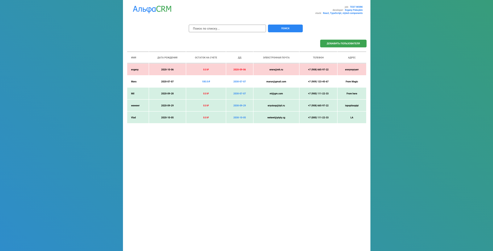
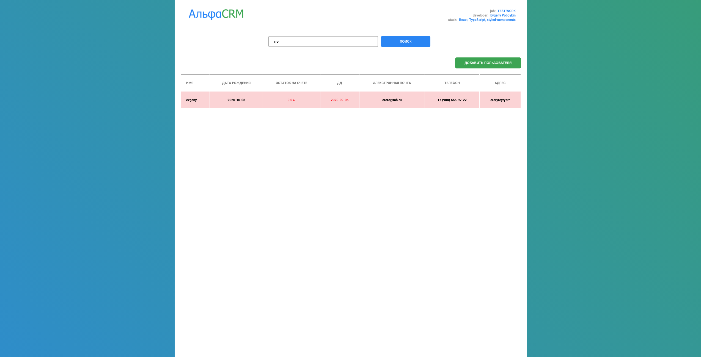

# Alfa CRM (test work for front-end developer job)

## Задача

-   Авторизовываться
-   Получать и отображать список клиентов постранично. Показывать поля:

          name (имя),
          dob (дата рождения),
          balance (остаток на счёте),
          e_date (дата деактивации клиента),
          email (электронная почта),
          phone (телефон),
          addr (адрес)

-   Если клиент неактивен (e_date в прошлом) выделять строку другим цветом
-   Если поле custom_foto не пустое, то показывать содержимое в виде аватара
-   Добавлять нового пользователя с полями 1,2,5,6,7. Помечать только что добавленного клиента другим цветом. При создании требуются обязательные поля: [branch_ids = [1], is_study = 1, legal_type = 1]
-   Искать клиентов по полю name (не обязательно, но будет плюсом)
-   Дизайн приложения на ваше усмотрение (не заморачивайтесь, но покажите, что вы умеете верстать)
-   Технологии:

        React
        TypeScript

-   Будет плюсом если вы напишете тесты на ваш код.

---

## Сделано

-   Авторизация / Получение Токена / Получение списка клиентов
-   Новый клиент выделяется "зеленым" цветом:

          - если он "НОВЫЙ" (втечение 1 дня)

-   Клиент выделяется "красным" цветом:

          - если поле e_date (дата деактивации клиента) < настоящей даты

-   Клиентские данные цвета:

        - если balance > 0 то данные выделяются синим, в противном случае красным
        - если e_date > Date.now то данные выделяются синим, в противном случае красным

-   Поиск по списку:

          name (имя),
          balance (остаток на счёте),
          email (электронная почта),
          phone (телефон),
          addr (адрес)

-   Добавление пользователя

```json
{
    "name": "",
    "email": "",
    "dob": "",
    "phone": [],
    "addr": [],
    "branch_ids": [1],
    "is_study": 1,
    "legal_type": 1
}
```

-   Форматирование данных (вывод ошибок):

          email = example@mail.com)
          phone = ввод без +7, формат +7 (ХХХ) ХХХ-ХХ-ХХ

-   Поведение кнопок типа "Submit" - не активна пока не будут заполнены все поля

-   Пагинация, количество клиентов 32 на странице

---

## !НЕ СДЕЛАНО / !НЕ ИСПРАВЛЕННО

-   dob - error "The format of Date of birth is invalid." - не понял какой формат

---

## Дизайн





