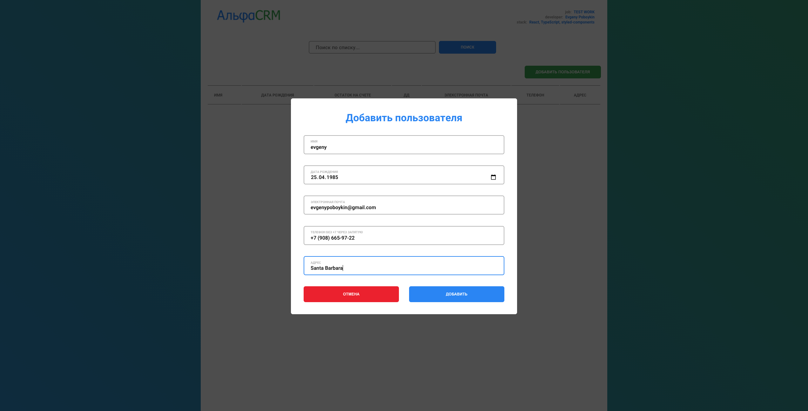

# Alfa CRM (test work for front-end developer job)

## Description

-   create UI for App
-   use React (TypeScript, Reducer, Context, lazy/Suspense)
-   work with api (fetching the data)
-   create display mode table/card
-   create filter (fields: name, balance, e_date, e-mail, phone, addr)
-   create form add user
-   if e_date < Date.now colored user in red
-   new users colored green (1 day)

## Concept

